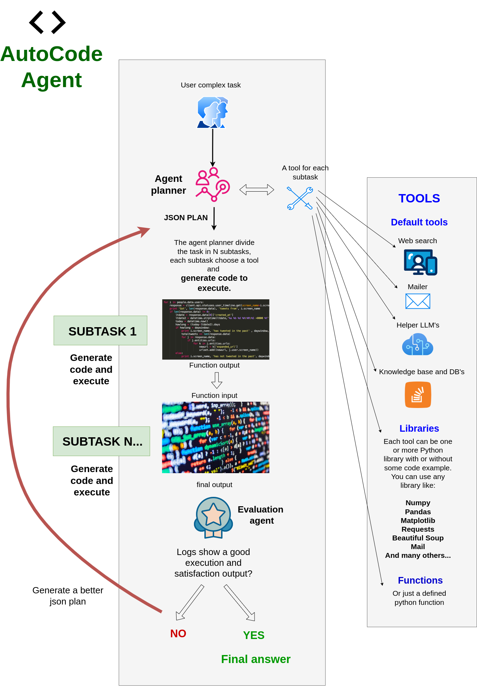

# AutoCodeAgent

Welcome to the Advanced AI Code Agent project! This intelligent agent leverages cutting-edge AI techniques to automatically generate, execute, and refine Python code in a modular and iterative way. It is designed to break down complex tasks into manageable subtasks, generate precise code for each, and orchestrate their execution using a variety of tools and libraries.

## Introduction
The Advanced AI Code Agent is an AI-powered system that automates the process of decomposing complex problems, writing Python code, executing that code, and evaluating the results. It uses a combination of AI language models, dynamic code execution, and an evaluation loop to refine its approach until the task is successfully completed. This repository provides a robust framework that you can extend to solve a wide range of problems by simply defining new tasks and integrating appropriate tools.

## Main Features
Task Decomposition: Automatically breaks down a complex main task into multiple smaller subtasks. Each subtask corresponds to a specific tool or function designed to handle a part of the problem, resulting in a clear and structured JSON plan.

## Dynamic Code Generation & Execution: 
For each subtask, the agent:
Generates Python code tailored to solve that specific subtask.
Executes the code to obtain outputs.
Feeds the output of one subtask as the input for the next, ensuring seamless data flow across the entire process.

## Flexible Tool Creation:
Library-Based Tools: Easily integrate Python libraries by specifying their names and usage examples. The agent can automatically generate code that leverages these libraries.
Custom Function Tools: Define specific functions as tools. The agent identifies these and avoids auto-generating code for them, ensuring custom implementations remain intact and reliable.

## Iterative Evaluation Loop:
A dedicated Evaluation Agent monitors execution logs, assesses whether the process ran successfully, and decides whether re-execution is necessary.
If errors or strange outputs are detected, the agent regenerates a new JSON plan with improved code and repeats the execution process.
The iterative loop continues until a satisfactory result is achieved or a maximum number of iterations is reached.

## Memory Logging & Error Handling:
Integrates a robust logging system to capture detailed execution logs. This allows for precise debugging and refinement of the agent's behavior.
Each subtask function includes error handling with try/except blocks to ensure graceful failure and informative logging, making the agent resilient to runtime issues.

## Modular and Extensible Design:
The framework encourages reusability and modularity by consolidating related operations within single functions when multiple subtasks require the same library. This maintains code efficiency and cleanliness.
Designed to integrate seamlessly with various Python libraries, allowing for flexible tool expansion without significant modifications to the core agent logic.

## Safe and Secure Execution:
Uses controlled namespaces and captures standard output to prevent unintended side effects during code execution.
Sanitizes outputs from AI model responses to ensure robust JSON parsing and prevent syntax issues in dynamically generated code.




## Each tool can be added in different ways:

1) specifying only the name of the Python library:
```python
    {
        "lib_name":["numpy"]
    }
```

2) specifying the library, providing a description, and a non-strict code example:
```python
    {
        "lib_name": ["geopy"],
        "instructions": "A library to get the coordinates of a given location.",
        "code_example": """
            from geopy.geocoders import Nominatim
            from geopy.exc import GeocoderTimedOut, GeocoderServiceError

            def get_coordinates({{user_agent, location}}):
            
                user_agent = "my-app/1.0"
                location = "Rome, Italy"
            
                geolocator = Nominatim(user_agent=user_agent)

                try:
                    # Geocode the location
                    geo_location = geolocator.geocode(location)
                    
                    if geo_location:
                        return (geo_location.latitude, geo_location.longitude)
                    else:
                        print(f"Location '{{location}}' not found.")
                        return None

                except GeocoderTimedOut:
                    print("Geocoding service timed out.")
                    return None
                except GeocoderServiceError as e:
                    print(f"Geocoding service error: {{e}}")
                    return None

        """
    }
```

3) defining a precise custom function associated with one or more libraries:
```python
            {
            "lib_names": ["smtplib", "email"],
            "instructions": "Send an email to the user with the given email, subject and html content.",
            "use_exaclty_code_example": True,
            "code_example": """
                def send_email(email: str, subject: str = "", html: str = "", GMAILUSER: str = "your_email@gmail.com", PASSGMAILAPP: str = "your_password") -> dict:

                    import smtplib
                    from email.mime.text import MIMEText
                    from email.mime.multipart import MIMEMultipart

                    # Gmail credentials
                    usermail = GMAILUSER
                    passgmailapp = PASSGMAILAPP

                    # SMTP server configuration
                    smtp_server = "smtp.gmail.com"
                    port = 587  # For TLS encryption

                    try:
                        # Create the email message
                        message = MIMEMultipart()
                        message["From"] = usermail
                        message["To"] = email
                        message["Subject"] = subject

                        # Attach the HTML content
                        if html:
                            message.attach(MIMEText(html, "html"))

                        # Establish connection to the SMTP server
                        with smtplib.SMTP(smtp_server, port) as server:
                            server.starttls()  # Secure the connection
                            server.login(usermail, passgmailapp)  # Log in to the SMTP server
                            
                            # Send the email
                            server.sendmail(usermail, email, message.as_string())

                        return {"info": "Email sent successfully"}

                    except Exception as error:
                        print(f"Error sending email: {{error}}")
                        return {}

                """
            }
```

4) Add tools such as LLMs for support:
```python
    {
        "lib_names": ["models"],
        "instructions": "An LLM usefull to elaborate any output from previous steps. Don't create loops, just use the LLM to elaborate the output for just one step.",
        "use_exaclty_code_example": True,
        "code_example": """
            from models.models import call_model
            prompt = f"<here you describe how to elaborate the previous output>: <previous_output>"
            llm_response = call_model(
                chat_history=[{"role": "user", "content": prompt}],
                model="o1-mini"
            )
            return {"elaborated_output": llm_response}
        """
    }
```


## Video Demo
Discover the capabilities of AutoCodeAgent with this [video demo](https://youtu.be/Ziqv953UM24).


# Application Setup

Follow the steps below to set up and run the pplication using Docker. This setup ensures that all necessary services are built and started correctly, with session management handled seamlessly via a Redis database.

## Prerequisites

- **Docker**: Ensure that Docker is installed on your system. You can download it from [here](https://www.docker.com/get-started).
- **Docker Compose**: Typically included with Docker Desktop installations. Verify by running `docker-compose --version`.

## Steps to Initialize the Application

 1. Clone the repository:

```bash
git clone https://github.com/samugit83/AutoCodeAgent
```

2. Navigate to the project directory:
```bash
cd interactive-multiagent
```

3. Build the Docker image:
```bash
docker-compose build
```

4. Run the Docker container:
```bash
docker-compose up -d
```

5. Check the backend logs:
```bash
docker logs -f flask_app
```

6. Access the application:
```bash
http://localhost:5000
```

- if you want to rebuild and restart the application:

```bash
docker-compose down
docker-compose build
docker-compose up -d
docker logs -f flask_app
```

- if you want to enter the app container's bash shell:
```bash
docker exec -it flask_app bash
```
